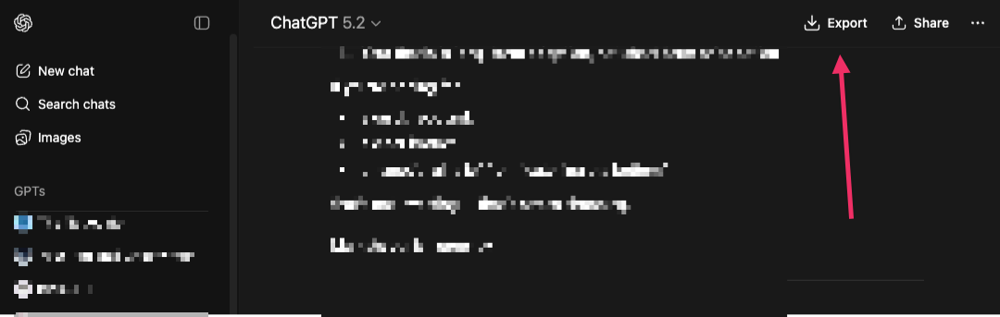

# ChatGPT Export

Chrome extension that exports ChatGPT conversations to Markdown.

Adds an **Export** button to the ChatGPT header (next to Share). Click it to download the current conversation as a clean `.md` file.

## Install

1. Clone or download this repository
2. Open `chrome://extensions/`
3. Enable **Developer mode** (top right toggle)
4. Click **Load unpacked** and select this folder

Works on any Chromium browser (Chrome, Edge, Brave, Arc).

## What it does

- Scrapes all conversation turns from the current page
- Converts assistant HTML to clean Markdown (headings, bold, italic, code blocks with language tags, lists, tables, blockquotes, links, images, horizontal rules)
- Preserves user messages as plain text
- Downloads as `{conversation-title}.md`

## How it works

| File | Purpose |
|------|---------|
| `manifest.json` | Manifest V3 config |
| `content.js` | Button injection, DOM scraping, HTML-to-Markdown conversion |
| `content.css` | Button and toast styles |
| `background.js` | Service worker that handles `chrome.downloads` |

The content script uses stable `data-*` attribute selectors (`data-testid`, `data-message-author-role`, `data-turn`) rather than CSS class names, which change frequently on ChatGPT.

A `MutationObserver` and History API hooks re-inject the button when navigating between conversations (SPA).

## Permissions

- **downloads** - to save the `.md` file
- **host_permissions: chatgpt.com** - to run the content script

No data leaves your browser. No external servers. No telemetry.

## Limitations

- Exports only what's currently in the DOM (very long conversations with lazy-loaded messages may be truncated)
- Waits for streaming to finish before allowing export
- Exports the currently visible branch only (not regenerated alternatives)
- Images are referenced by URL, not downloaded
